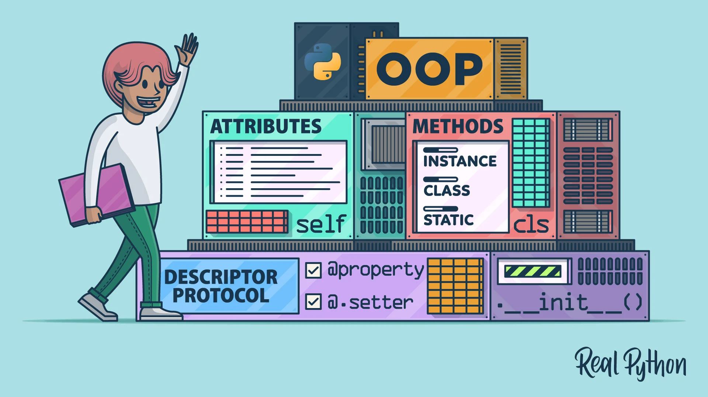

# OOP - Object Oriented Programming


---


---

# 1. Class (Klass)
`(ENG)`
**A class is a template for creating objects. A class includes properties (attributes) and methods (methods). You can create objects using a class.**

`(UZ)`
**Klass — obyektlarni yaratish uchun shablon. Klass o'z ichiga xususiyatlar (attributes) va metodlar (methods) oladi. Klass yordamida siz obyektlar yaratishingiz mumkin.**

### _Example:_
```python
# class
class Book:
    def __init__(self, book_name, book_id, book_author):
        self.book_name = book_name
        self.book_id = book_id
        self.book_author = book_author

    def say_book_name(self):
        return f"Book name is {self.book_name}"

# objects

fairy_tale_book = Book("Harry Potter and secret room", 1, "Joanna Ketlin Rouling")
print(fairy_tale_book.say_book_name())
```

### _Result:_
```text 
Book name is Harry Potter and secret room
```

---
# 2. Objects (Objektlar)
`(ENG)`
**An object is a concrete instance created from a class. Objects inherit the properties and methods of the class and have their own state.**

`(UZ)`
**Obyekt — klassdan yaratilgan aniq instansiya. Obyektlar klassning xususiyatlarini va metodlarini oladi va o'z holatiga ega bo'ladi.**

### _Example_:
```python
class Car:
 ...
 ...
my_car = Car("Toyota", "Corolla")
print(my_car.display_info())  # Toyota Corolla
```

### _Result:_
```text
My car brand is Toyota.My car name is Corolla
```

----
# 3. Inheritance (Meros Olish)
`(ENG)`
**Inheritance is the creation of a new class from an existing class. A new class inherits the properties and methods of the parent class and can add its own properties or methods.**

`(UZ)`
**Meros olish — yangi klassni mavjud klassdan yaratish. Yangi klass ota klassning xususiyatlarini va metodlarini meros oladi va o'ziga xos xususiyatlar yoki metodlarni qo'shishi mumkin.**

### _Example:_
```python
# Father class
class Fruit:
    def __init__(self, name, color):
        self.name = name
        self.color = color

# Inheritance class
class SweetFruit(Fruit):
    def __init__(self, name, color, taste, tip):
        super().__init__(name, color)  # Father class call the constructor
        self.taste = taste
        self.tip = tip

    def show_display(self):
        return f"This fruit's name is {self.name}. It's {self.taste} and {self.tip}."

# SweetFruit create object
apple = SweetFruit("apple", "red", "sweet", "delicious")

# show result
print(apple.show_display())  # This fruit's name is apple. It's sweet and delicious.
```

### _Result:_
```text
This fruit's name is apple. It's sweet and delicious.
```

---
# 4. Polymorphism (Polimorfizm)
`(ENG)`
**Polymorphism is the ability of a method to work with several types of objects. This means that methods or functions appear with the same name but with different operations.**

`(UZ)`
**Polimorfizm — bir metod bir necha turdagi obyektlar bilan ishlash qobiliyatidir. Bu metodlar yoki funksiyalar bir xil nom bilan, lekin turli ishlashlar bilan ko'rinishini bildiradi.**

### _Example:_
```python
# Father class
class Pen:
    def __init__(self, color, price, brand):
        self.color = color
        self.price = price
        self.brand = brand

    # method
    def show_info(self):
        return f"This pen's color is {self.color}\nThis pen's price is {self.price}\nThis pen's brand is {self.brand}"

# Inheritance class
class RedPen(Pen):
    def __init__(self, color, price, brand, thickness):
        super().__init__(color, price, brand)
        self.thickness = thickness
    # Polymorphism
    def show_info(self):
        return f"This pen's color is {self.color}\nThis pen's price is {self.price}\nThis pen's brand is {self.brand}\nThis pen's thickness is {self.thickness}"

# result function for show the difference
def show_result(pen_info):
    print(pen_info.show_info())

pen = Pen("blue","1$","Lamy")
red_pen = RedPen("red","2$","Pilot","1.2mm")

show_result(pen)
print("----------------------------------------")
show_result(red_pen)
```

### _Result:_
```text
This pen's color is blue
This pen's price is 1$
This pen's brand is Lamy
----------------------------------------
This pen's color is red
This pen's price is 2$
This pen's brand is Pilot
This pen's thickness is 1.2mm
```

# 5.Encapsulation (Inkapsulyatsiya)
`(ENG)`
**Encapsulation is hiding the internal state of an object and providing access only through the required interface. This makes it easier to manage the internal state of the object and increases security.**

`(UZ)`
**Inkapsulyatsiya — obyektning ichki holatini yashirish va faqat kerakli interfeys orqali kirishni ta'minlashdir. Bu obyektning ichki holatini boshqarishni osonlashtiradi va xavfsizlikni oshiradi.**

### _Example:_
```python
class BankAccount:
    def __init__(self, balance):
        self.__balance = balance  # Private attribute

    def deposit(self, amount):
        self.__balance += amount

    def withdraw(self, amount):
        if amount <= self.__balance:
            self.__balance -= amount
        else:
            print("Insufficient funds")

    def get_balance(self):
        return self.__balance


base_account = BankAccount(100_000)
deposit_balance = BankAccount.deposit(base_account, 300_000)
print(BankAccount.get_balance(base_account))
```

### _Result:_
```text
400000
```

---

# 6.Abstraction (Abstraktsiya)
`(ENG)`
**Abstraction is hiding specific details and ensuring that only the necessary features are displayed. It simplifies complex systems and provides a minimal user interface.**

`(UZ)`
**Abstraktsiya — aniq detallarni yashirish va faqat kerakli xususiyatlarni ko'rsatishni ta'minlashdir. Bu kompleks tizimlarni soddalashtiradi va foydalanuvchiga minimal interfeysni taqdim etadi.**

### _Example:_
```python
from abc import ABC, abstractmethod

# Abstraction class
class Document(ABC):
    @abstractmethod
    def save(self, filename):
        pass

    @abstractmethod
    def open(self, filename):
        pass

# Subclass 1
class WordDocument(Document):
    def save(self, filename):
        return f"Word document saved as {filename}.docx"

    def open(self, filename):
        return f"Word document {filename}.docx opened"

# Subclass 2
class PDFDocument(Document):
    def save(self, filename):
        return f"PDF document saved as {filename}.pdf"

    def open(self, filename):
        return f"PDF document {filename}.pdf opened"

# Create objects
word_doc = WordDocument()
pdf_doc = PDFDocument()

print(word_doc.save("example"))  # Word document saved as report.docx
print(word_doc.open("example"))  # Word document report.docx opened

print(pdf_doc.save("example"))  # PDF document saved as report.pdf
print(pdf_doc.open("example"))  # PDF document report.pdf opened
```

### _Result:_
```text
Word document saved as example.docx
Word document example.docx opened
PDF document saved as example.pdf
PDF document example.pdf opened
```

